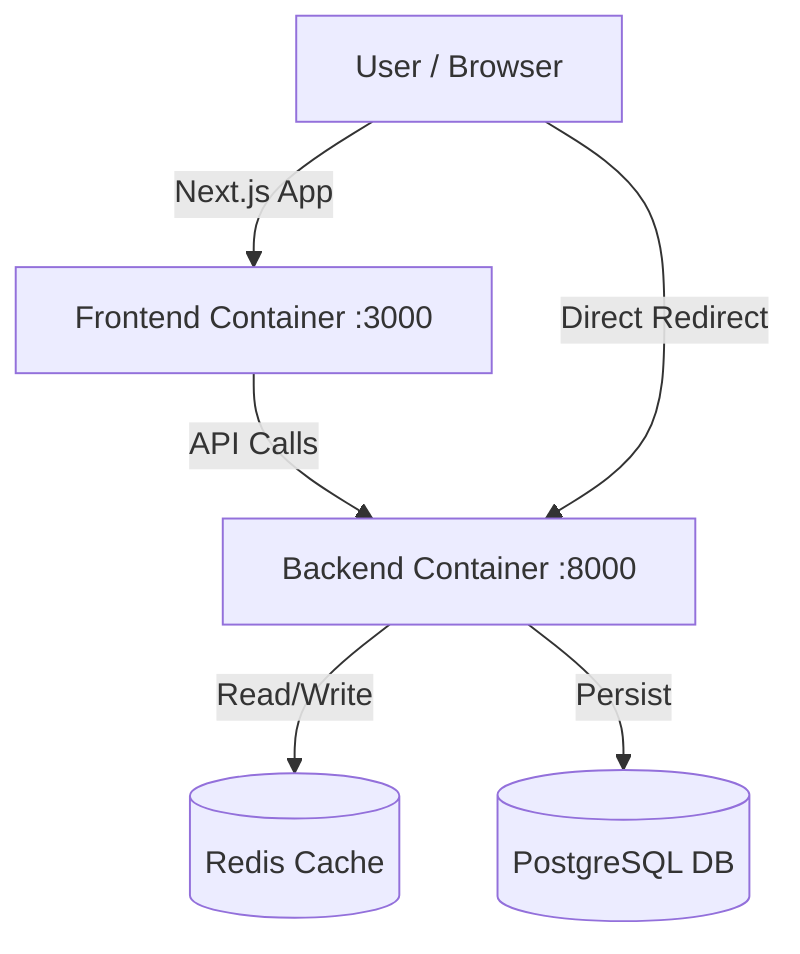

# 🚀 Next-Gen URL Shortening Service

A production-ready, full-stack URL shortener featuring a **Cyberpunk/Glassmorphism UI**, real-time analytics, and high-performance caching. Built for speed, scalability, and aesthetics.


---

## ✨ Key Features

### 🎨 User Experience (Frontend)
- **Cyberpunk Aesthetics**: Neon gradients, glassmorphism panels, and smooth animations using `Framer Motion`.
- **QR Code Generation**: Instantly generate QR codes for every shortened link.
- **Smart History**: Automatically saves your recent links to local storage.
- **Responsive**: Fully optimized for mobile and desktop.

### ⚙️ Engine (Backend)
- **High Performance**: `FastAPI` + `Redis` caching for sub-millisecond redirects.
- **Rate Limiting**: Protects against abuse (10 requests/min per IP).
- **Analytics**: Tracks click counts and metadata.
- **Scalable DB**: Powered by `PostgreSQL` with Async SQLAlchemy.

### 🛠️ DevOps
- **Dockerized**: Entire stack runs with a single command.
- **Secure**: Environment variables managed via `.env`.

---

## 🚀 Quick Start

### Prerequisites
- Docker & Docker Compose

### 1. Run the Project
Start all services (Frontend, Backend, DB, Redis) with one command:
```bash
docker-compose up --build -d
```

### 2. Access the App
- **Frontend (UI)**: [http://localhost:3000](http://localhost:3000)
- **Backend API Docs**: [http://localhost:8000/docs](http://localhost:8000/docs)

### 3. Verify Installation
Run the automated test suite to verify Shortening, Redirects, Stats, and Rate Limiting:
```bash
python test_api.py
```

### 4. Stop Services
```bash
docker-compose down
```

---

## 🏗 Architecture



---

## 📂 Project Structure

```
URL-Shortening-Service/
├── backend/                # FastAPI Application
│   ├── app/
│   │   ├── api/            # API Routes
│   │   ├── core/           # Config & Security
│   │   ├── db/             # Database & Models
│   │   ├── services/       # Business Logic
│   └── Dockerfile
├── frontend/               # Next.js Application
│   ├── app/                # Pages & Layouts
│   ├── components/         # UI Components
│   └── Dockerfile
├── docker-compose.yml      # Orchestration
├── test_api.py             # Verification Script
└── README.md               # Documentation
```

---

## � API Endpoints

| Method | Endpoint | Description |
| :--- | :--- | :--- |
| `POST` | `/api/v1/shorten` | Create a short URL |
| `GET` | `/{shortCode}` | Redirect to original URL |
| `GET` | `/api/v1/shorten/{code}` | Get URL metadata |
| `GET` | `/api/v1/shorten/{code}/stats` | Get usage statistics |
| `PUT` | `/api/v1/shorten/{code}` | Update destination URL |
| `DELETE` | `/api/v1/shorten/{code}` | Delete URL |

---

**Generated by Antigravity AI**
